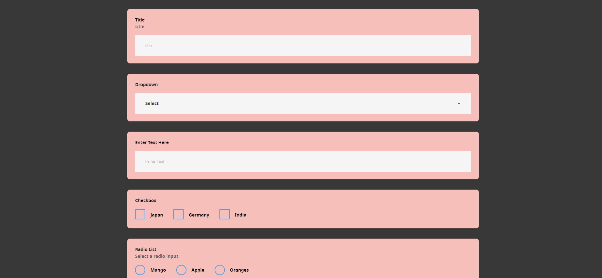

# Project README

## Screenshot



## Project Overview

This project consists of a React frontend located in the `/frontend` directory and a Node.js server located in the `/backend` directory. The frontend is a single-page application (SPA) that communicates with the backend server via RESTful APIs. This README provides instructions on how to set up, run, and manage both parts of the application.

## Prerequisites

Ensure you have the following software installed on your machine:

- [Node.js](https://nodejs.org/en/download/)
- [npm](https://www.npmjs.com/get-npm) (comes with Node.js)
- [Git](https://git-scm.com/downloads)

## Getting Started

### Clone the Repository

```sh
git clone https://github.com/Bhoomaahamso/oolib-dynamic-form.git
cd oolib-dynamic-form
```

## Setting Up the Backend (Node.js)

### Open a Terminal and Navigate to the Backend Directory

```sh
cd backend
```

### Install Dependencies

```sh
npm install
```

### Run the Development Server

```sh
node index
```

This will start the Node.js server. By default, the server will be accessible at `http://localhost:4000`. Make sure port 4000 is available.


# API Documentation

## Endpoint: Get Data

### Description

This endpoint retrieves data from a sample dataset and returns it in JSON format. It is designed to handle requests asynchronously and provides appropriate error handling.

### Method

`GET`

### URL

`/api/form`

### Request Parameters

None.

### Example Request

```http
GET /api/form HTTP/1.1
Host: localhost:4000
```

## Setting Up the Frontend (React)

### Navigate to the Frontend Directory

```sh
cd frontend
```

### Install Dependencies

```sh
npm install
```

### Run the Development Server

```sh
npm start
```

This will start the React development server. You can view the application by navigating to `http://localhost:3000` in your web browser.
